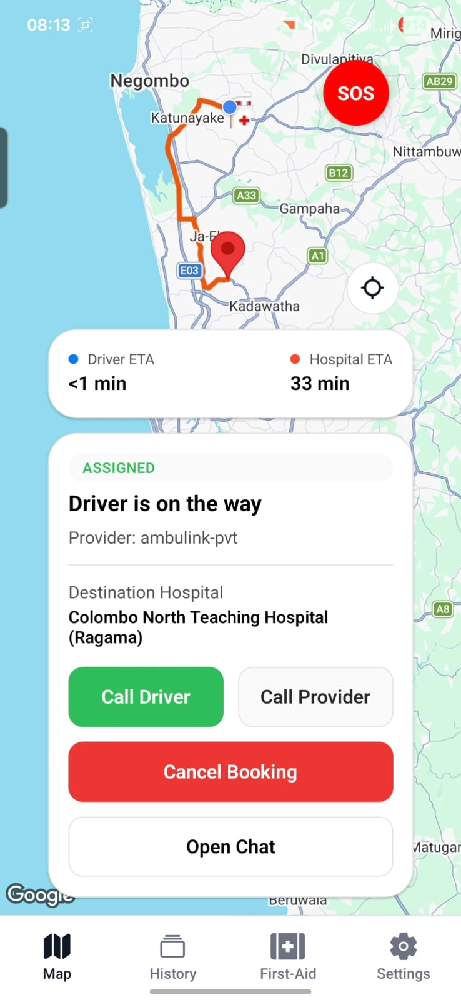
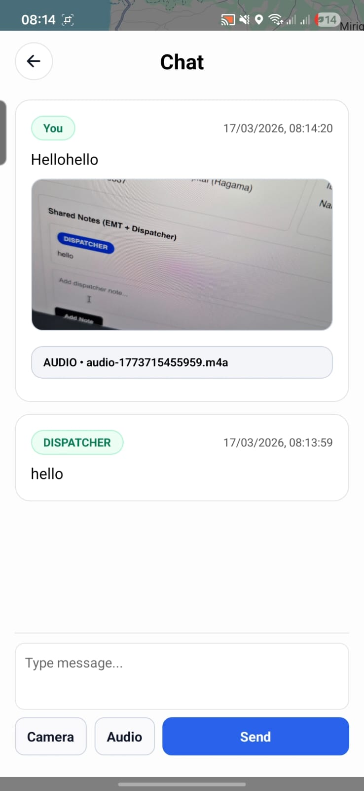
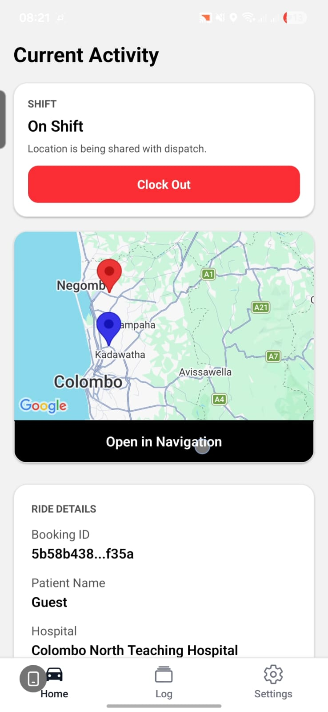
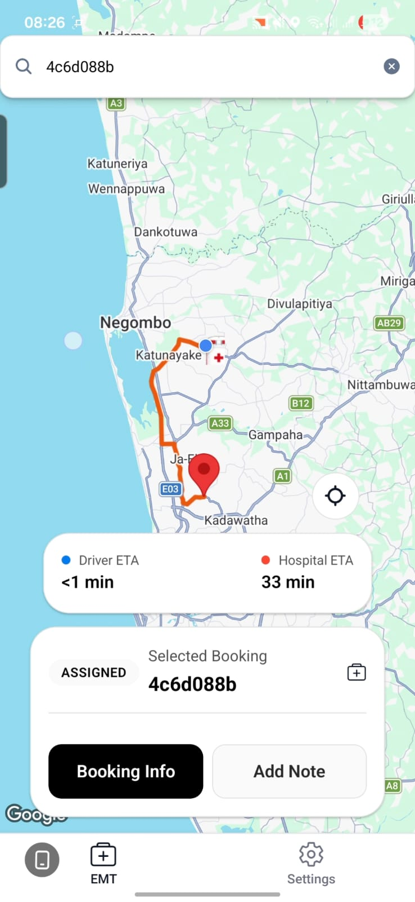
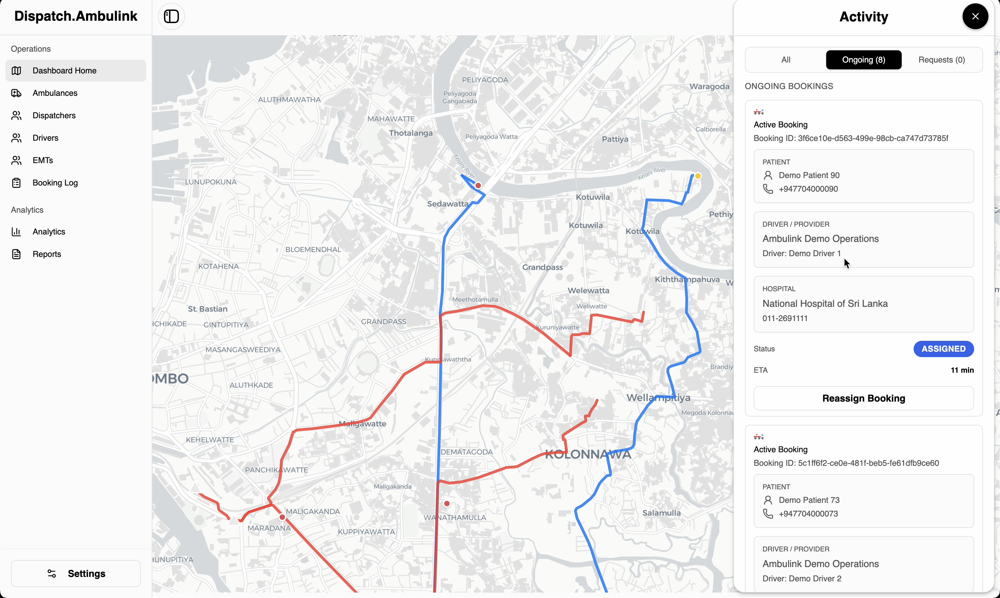
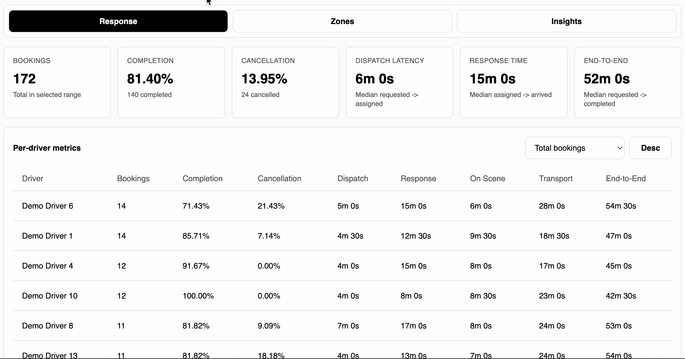
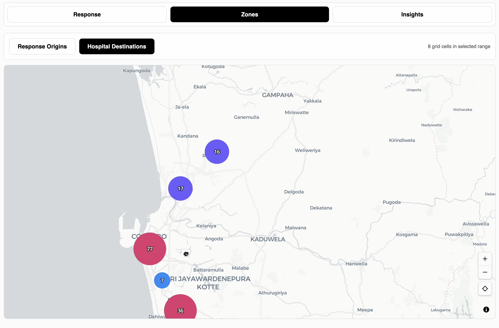
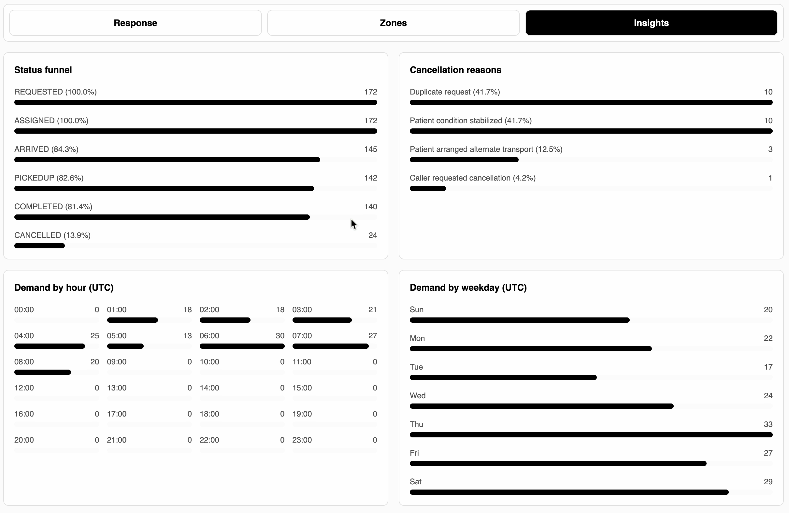

# Ambulink

Ambulink is a comprehensive software suit for emergency response, for ambulance dispatch and patient transport coordination.

The repository is a monorepo with:
- A dispatcher web dashboard
- A multi role mobile app (Patient, Driver, EMT)
- A NestJS backend with REST + real-time socket events

## Core Workflow

1. A patient creates a booking request from the mobile app.
2. The backend publishes the request to relevant dispatchers in real time.
3. A dispatcher accepts and assigns the trip.
4. Driver and EMT receive updates and navigate to the patient/hospital.
5. Patient and dispatcher track booking progress live.
6. Booking logs, notes, and analytics are available for operations review.

## Key Features

### Patient App

- One tap emergency booking from map view
- Live ambulance tracking and booking status
- In-app chat with responders/operations
- First-aid support screen
- Booking history and patient profile/settings

| Booking | Chat |
|---|---|
|  |  |

### Driver App

- Real-time assigned ride updates
- Pickup/drop-off route and location tracking
- Shift and trip log visibility



### EMT App

- Live assigned booking feed
- Patient information view during active trips
- EMT notes and clinical timeline updates
- EMT settings and role workflow support



### Dispatcher Dashboard

- Live booking request queue and acceptance flow
- Ongoing booking tracking with map overlays (patients, drivers, routes, hospitals)
- Reassignment flow for active bookings
- Operations management pages for drivers, EMTs, patients, ambulances, and dispatchers
- Analytics tabs for response and zone-level insights

| Tracking & Bookings | Analytics 1 |
|---|---|
|  |  |

| Analytics 2 | Analytics 3 |
|---|---|
|  |  |

## Tech Stack

- Monorepo: Turbo + npm workspaces
- Backend: NestJS, Drizzle ORM, PostgreSQL, Socket.IO, Zod
- Web Dashboard: React 19, Vite, TanStack Query, MapLibre
- Mobile: Expo + React Native + Expo Router + Socket.IO

## Repository Structure

```text
apps/
  backend/            # NestJS API + realtime events
  client-dashboard/   # Dispatcher dashboard (React + Vite)
  mobile/             # Patient/Driver/EMT mobile app (Expo)
packages/
  types/              # Shared type definitions
  eslint-config/      # Shared lint config
  prettier-config/    # Shared prettier config
```

## Getting Started

### Prerequisites

- Node.js 20+
- npm 10+
- PostgreSQL
- (Optional) Redis

### 1) Install dependencies

```bash
npm install
```

### 2) Configure environment

Copy `.env_example` to `.env` and update values for your environment.

```bash
cp .env_example .env
```

### 3) Sync app-specific env files

```bash
npm run env:sync
```

### 4) Initialize database

```bash
npm run migrate
npm run seed
```

### 5) Run all apps in development

```bash
npm run dev
```

## Deployment

Containerized deployment assets are under `deploy/`.
A Dokploy-compatible compose file is available at:

- `deploy/compose/docker-compose.dokploy.yml`

It includes services for backend, dashboard, optional Postgres, and optional Redis.
